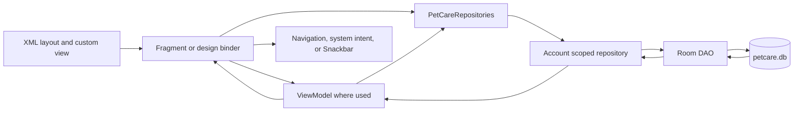
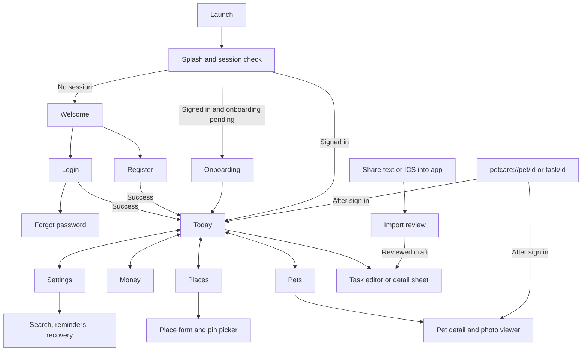
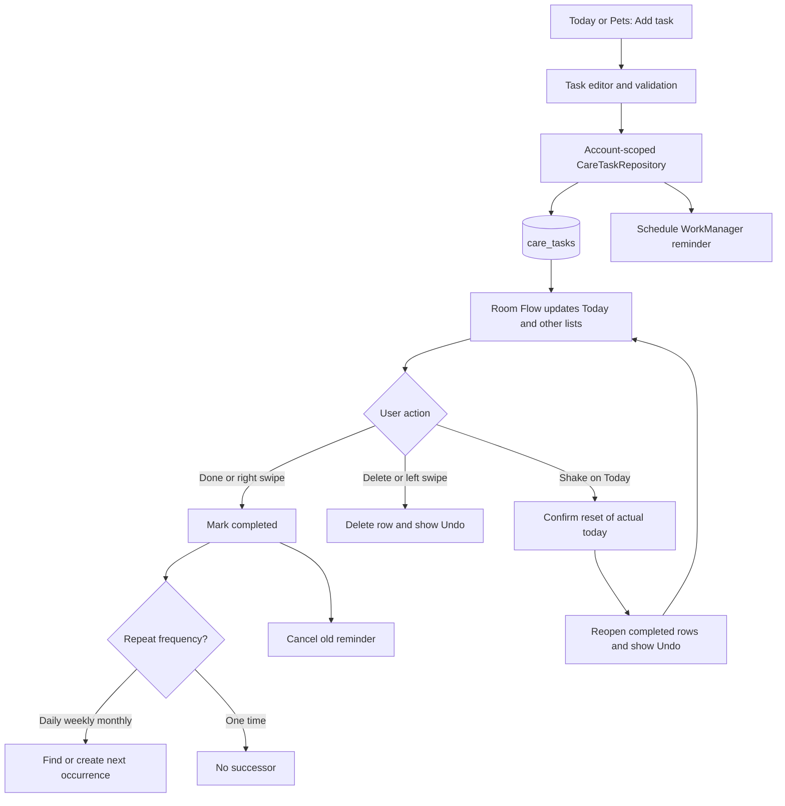
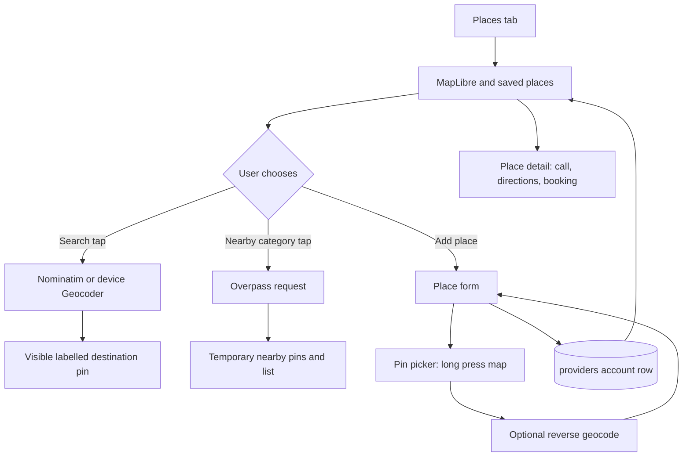
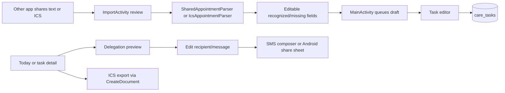
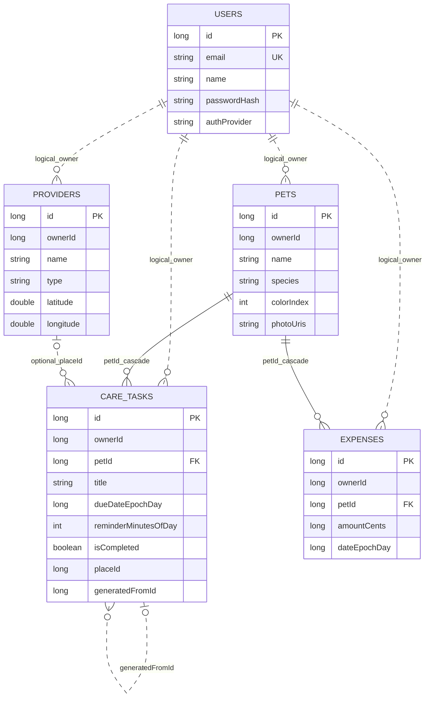
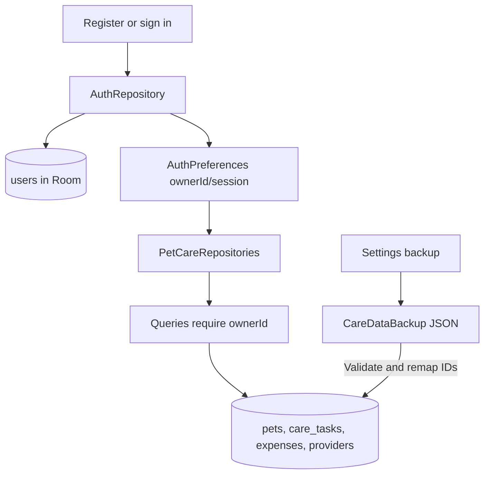

# PetCare: design, architecture, features, and wireframe guide

**Source snapshot:** 5 October 2026, current working tree in this checkout. This is a guide to the native Kotlin/XML app, including uncommitted source. It is also a handoff for drawing wireframes from the implemented interface. The older `README.md` and `PROJECT_STATUS.md` describe some earlier releases, so use the linked current source when they disagree with this guide.

## 1. What this project is

PetCare is a **single module native Android app** (`:app`) for keeping pet profiles, care tasks, expenses, and useful places. Its primary submission area is location and geotagging. Care records are local to the device and scoped to a signed in local account. The application ID and Kotlin namespace are `com.example.petcare`; the build declares Android **min API 24, target API 36, compile API 37**, version `2.0.0`. The interface is XML and Material 3, with Kotlin Fragments and custom views. Sources: [app/build.gradle.kts](app/build.gradle.kts), [AndroidManifest.xml](app/src/main/AndroidManifest.xml), [settings.gradle.kts](settings.gradle.kts).

The five primary tabs are **Today, Pets, Money, Places, Settings**. A `NavHostFragment` fills the remaining space; phones use a bottom navigation bar and `w600dp` layouts use a left navigation rail. Secondary screens hide the primary navigation. Sources: [activity_main.xml](app/src/main/res/layout/activity_main.xml), [tablet activity_main.xml](app/src/main/res/layout-w600dp/activity_main.xml), [main_navigation.xml](app/src/main/res/menu/main_navigation.xml), [MainActivity.kt](app/src/main/java/com/example/petcare/MainActivity.kt).

### Read this guide in order

1. Sections 2–4 show project folders, technical layers, and screen routes.
2. Sections 5–7 give the design system, screen inventory, and drawable wireframe plans.
3. Sections 8–10 explain features, task and external-service flows, and the database.
4. Sections 11–13 list dependencies, privacy boundaries, build/test entry points, and wireframe handoff checks.

## 2. Project structure and ownership

```text
PetCare/
├── app/
│   ├── build.gradle.kts                 Android configuration and dependencies
│   ├── schemas/.../1.json ... 14.json    exported Room migration snapshots
│   ├── src/main/
│   │   ├── AndroidManifest.xml           entry points, permissions, widget
│   │   ├── java/com/example/petcare/
│   │   │   ├── MainActivity.kt           navigation host and incoming intents
│   │   │   ├── ImportActivity.kt         visible review of shared text/ICS
│   │   │   ├── PetCareApplication.kt     theme and notification channels
│   │   │   ├── data/local/               Room, DAOs, repositories, preferences
│   │   │   │   ├── backup/                JSON care-data backup/restore
│   │   │   │   ├── care/                  tasks, recurrence, repository
│   │   │   │   ├── expense/               spending records and insights
│   │   │   │   ├── pet/                   profiles, colours, deletion transaction
│   │   │   │   ├── provider/              saved places
│   │   │   │   └── user/                  local accounts and authentication
│   │   │   ├── design/                   v5 screen binders, state, custom views
│   │   │   ├── integration/              text/ICS parsers and ICS export
│   │   │   ├── location/                 tiles, geocoding, Nominatim, Overpass
│   │   │   ├── reminders/                WorkManager task reminders
│   │   │   ├── ui/                       Fragments, ViewModels, state mappers
│   │   │   ├── widget/                   Android home-screen widget
│   │   │   └── debugdata/                demo records for debuggable builds
│   │   └── res/
│   │       ├── navigation/nav_graph.xml  destinations, arguments, deep links
│   │       ├── layout/                   phone screens, rows, sheets, widget
│   │       ├── layout-w600dp/            tablet navigation host
│   │       ├── values/ and values-night/ light/dark tokens, text, dimensions
│   │       ├── drawable/ and font/       icons, surfaces, Barlow fonts
│   │       └── menu/ and xml/            actions, widget, backup rules
│   ├── src/test/                         JVM unit tests
│   ├── src/androidTest/                  Android/Room/UI tests
│   └── src/debug/                        component gallery/debug resources
├── gradle/libs.versions.toml            version catalog
├── README.md                             general project readme
└── PETCARE_DESIGN_ARCHITECTURE_AND_WIREFRAMES.md
```

| Package or file | Responsibility | Where to start reading |
| --- | --- | --- |
| `com.example.petcare` | App startup, single activity, inbound share review | [MainActivity.kt](app/src/main/java/com/example/petcare/MainActivity.kt), [ImportActivity.kt](app/src/main/java/com/example/petcare/ImportActivity.kt) |
| `data.local` | Room database v14, account-scoped repository factory, preferences | [PetCareDatabase.kt](app/src/main/java/com/example/petcare/data/local/PetCareDatabase.kt), [PetCareRepositories.kt](app/src/main/java/com/example/petcare/data/local/PetCareRepositories.kt) |
| `data.local.pet` | Pet CRUD, photos, deletion with child records | [PetEntity.kt](app/src/main/java/com/example/petcare/data/local/pet/PetEntity.kt), [PetDeletionRepository.kt](app/src/main/java/com/example/petcare/data/local/pet/PetDeletionRepository.kt) |
| `data.local.care` | Care tasks, recurrence, completion, reset, owner filtering | [CareTaskEntity.kt](app/src/main/java/com/example/petcare/data/local/care/CareTaskEntity.kt), [CareTaskRepository.kt](app/src/main/java/com/example/petcare/data/local/care/CareTaskRepository.kt) |
| `data.local.expense` | Expense CRUD, summaries, CSV, insights | [ExpenseEntity.kt](app/src/main/java/com/example/petcare/data/local/expense/ExpenseEntity.kt), [ExpenseInsights.kt](app/src/main/java/com/example/petcare/data/local/expense/ExpenseInsights.kt) |
| `data.local.provider` | Saved place CRUD | [ProviderEntity.kt](app/src/main/java/com/example/petcare/data/local/provider/ProviderEntity.kt) |
| `data.local.user` and `design/AccountSecurity.kt` | Account rows, password and recovery verification | [AuthRepository.kt](app/src/main/java/com/example/petcare/data/local/user/AuthRepository.kt), [AccountSecurity.kt](app/src/main/java/com/example/petcare/design/AccountSecurity.kt) |
| `data.local.backup` | Export and merge restore of one account's care data | [CareDataBackup.kt](app/src/main/java/com/example/petcare/data/local/backup/CareDataBackup.kt) |
| `ui.auth`, `ui.home`, `ui.pets`, `ui.care` | Authentication, Today, pets, task screens | [ui directory](app/src/main/java/com/example/petcare/ui) |
| `ui.expenses`, `ui.providers`, `ui.search`, `ui.settings` | Money, Places, cross-record search, settings | [ui directory](app/src/main/java/com/example/petcare/ui) |
| `design` | XML-to-state binding and purpose-built views; notably Today/Pets/Auth binders | [TodayScreenBinder.kt](app/src/main/java/com/example/petcare/design/TodayScreenBinder.kt), [PetsScreenBinder.kt](app/src/main/java/com/example/petcare/design/PetsScreenBinder.kt) |
| `location` | MapLibre raster style, saved/nearby pins, text search, device geocoder | [OpenStreetMapTiles.kt](app/src/main/java/com/example/petcare/location/OpenStreetMapTiles.kt), [NominatimPlaceSearch.kt](app/src/main/java/com/example/petcare/location/NominatimPlaceSearch.kt), [NearbyOsmPlaces.kt](app/src/main/java/com/example/petcare/location/NearbyOsmPlaces.kt) |
| `integration` | External appointment parsing and care-plan ICS encoding | [integration directory](app/src/main/java/com/example/petcare/integration) |
| `reminders`, `widget` | Background reminders/notification entry points and launcher widget | [CareReminderScheduler.kt](app/src/main/java/com/example/petcare/reminders/CareReminderScheduler.kt), [CareWidgetProvider.kt](app/src/main/java/com/example/petcare/widget/CareWidgetProvider.kt) |

### How one screen reaches stored data



`PetCareRepositories` reads the current `ownerId` and creates pet, task, expense, place, and account-data repositories for that account. Most primary lists expose Room `Flow` through `StateFlow<ScreenState<...>>`; `ScreenState` has Loading, Empty, Content, and Error variants. Some forms and detail screens read repositories directly from a Fragment, so this is an **actual source structure**, not a claim that every screen follows identical MVVM. Sources: [PetCareRepositories.kt](app/src/main/java/com/example/petcare/data/local/PetCareRepositories.kt), [ScreenState.kt](app/src/main/java/com/example/petcare/ui/ScreenState.kt), [TodayViewModel.kt](app/src/main/java/com/example/petcare/ui/home/TodayViewModel.kt).

## 3. App navigation and user journeys

The graph starts at Splash, which asks `AuthRepository.bootstrap()` for a valid account and routes to Welcome, Onboarding, or Today. The current registration/Google-account paths mark onboarding complete, so the onboarding destination exists but is normally bypassed after a new registration. `MainActivity` also queues imported drafts and private deep links until a primary destination is available and authentication is complete. Sources: [nav_graph.xml](app/src/main/res/navigation/nav_graph.xml), [SplashFragment.kt](app/src/main/java/com/example/petcare/ui/auth/SplashFragment.kt), [AuthRepository.kt](app/src/main/java/com/example/petcare/data/local/user/AuthRepository.kt), [MainActivity.kt](app/src/main/java/com/example/petcare/MainActivity.kt).



**Routes versus screens:** `petcare://pet/{petId}` and `petcare://task/{taskId}` are Android app deep links in [nav_graph.xml](app/src/main/res/navigation/nav_graph.xml). They are not web/API endpoints. SMS, calling, maps/directions, documents, and a browser for booking are delegated with Android intents. There is no PetCare backend or cloud API in this checkout.

### Navigation destination and wireframe inventory

Every row below is a destination in [nav_graph.xml](app/src/main/res/navigation/nav_graph.xml). A sheet/dialog is marked where the destination is a dialog or the UI opens a sheet independently of the graph.

| Destination | Screen/layout to draw | Main visible regions and interaction |
| --- | --- | --- |
| Splash | `fragment_splash.xml` | Startup handoff; routes by local session |
| Welcome | `pc_fragment_welcome.xml` | Brand illustration/rings, create account, Google sign in, log in |
| Login | `pc_fragment_login.xml` | Email, password, stay signed in, recovery, biometric and Google options |
| Register | `pc_fragment_register.xml` | Name, email, optional phone, password strength/rules, confirm password, security question/answer, Google option |
| Forgot password | `pc_fragment_forgot_password.xml` | Multi-step local security-answer recovery and password change |
| Onboarding | `fragment_onboarding.xml` | Intro pages and navigation to add pet/Today; usually skipped by current registration |
| Today | `pc_fragment_today.xml` | Greeting/bell, next up, pet rings, quick actions, week strip, timeline, glance, add FAB |
| Notifications | `pc_fragment_notifications.xml` | In-app inbox with sections and task opening |
| Pets | `pc_fragment_pets.xml` | Pet grid, coming up tasks, month spending summary, add pet |
| Pet detail | `fragment_pet_detail.xml` | Photo/pet pager, stats, Care/Health/Profile/Spending tabs, edit/share |
| Photo viewer | `fragment_photo_viewer.xml` | Full-screen photo paging and zoom gestures |
| Add pet | `fragment_add_pet.xml` | Pet profile/health fields and multiple document-picked photos |
| Edit pet | `fragment_add_pet.xml` | Same form, populated from selected pet |
| Add care task | `pc_fragment_task_editor.xml` | Title, pet/category, date/time, repeat, optional place, supplies, notes |
| Edit care task | `pc_fragment_task_editor.xml` | Same form, populated from selected task |
| Reminder settings | `fragment_reminder_settings.xml` | Default time picker and Save/Cancel |
| Routine generator | `fragment_routine_generator.xml` | Choose pet and feeding/exercise/grooming/medication/health templates |
| Money | `fragment_expense_list.xml` | Current-month total, pet split, insights chart, categories, recent rows, CSV/PDF, add |
| Expense editor | `fragment_add_expense.xml` | **Dialog** for add/edit amount, pet, category, date, note |
| Places | `fragment_provider_list.xml` | Map with saved/nearby markers, category filters, search, draggable list sheet, add |
| Add/edit place | `fragment_add_provider.xml` | Place type/name/address, contact and hours, coordinates, map picker |
| Pin picker | `fragment_place_picker.xml` | Map, long-press pin, location/address status, Use pin |
| Delegation preview | `fragment_delegation_preview.xml` | Editable checklist, contact picker/number, SMS and share |
| Settings | `fragment_settings.xml` | Profile, appearance, reminders, notifications, security, backup/data, help, sign out |
| Search | `fragment_search.xml` | Cross-record query plus pet/category/date filters and results |

Additional interface pieces used inside screens are [task detail sheet](app/src/main/res/layout/pc_sheet_task_detail.xml), [place detail sheet](app/src/main/res/layout/sheet_place_detail.xml), [gesture guide dialog](app/src/main/res/layout/dialog_gesture_coach.xml), [account recovery dialog](app/src/main/res/layout/dialog_account_recovery.xml), notification/row/card XML in [layout/](app/src/main/res/layout), and [widget_care.xml](app/src/main/res/layout/widget_care.xml).

## 4. Design system: what the wireframes should preserve

The source calls this the **Pit Lane** design. It is an **Android resource design**, so styling lives in XML resources and custom Kotlin views, not in CSS. The v5 tokens are in [pc_colors.xml](app/src/main/res/values/pc_colors.xml), [night pc_colors.xml](app/src/main/res/values-night/pc_colors.xml), [pc_type.xml](app/src/main/res/values/pc_type.xml), [pc_components.xml](app/src/main/res/values/pc_components.xml), [pc_themes.xml](app/src/main/res/values/pc_themes.xml), and [dimens.xml](app/src/main/res/values/dimens.xml). Drawings/backgrounds live in [drawable/](app/src/main/res/drawable); screen composition lives in [layout/](app/src/main/res/layout).

| Design decision | Current value or rule | Wireframe instruction |
| --- | --- | --- |
| Theme | Dark is default; Light and System are selectable | Draw dark as primary, add light variant rather than substituting wallpaper colours |
| Canvas/surface | Dark `#000000` / `#111113`; light `#F5F5F7` / `#FFFFFF` | Show content cards against a distinct canvas |
| Primary action | Orange `#FF6B00`, black text/icons on filled orange | Reserve accent for actions and time emphasis |
| Text | Dark primary `#F4F4F5`; light primary `#0B0B0F` | Keep primary and supporting hierarchy distinct |
| Feedback | Error, warning, success tokens; pet identity colours in custom views | Indicate state with text/icon as well as colour |
| Fonts | Barlow Condensed bold/extrabold for display, time, countdown, money; Barlow for body/controls | Use exact display/body split; Google button uses Android sans-serif medium |
| Type sizes | Countdown 52sp, display 32sp, hero 44sp, amount 34sp, body 15sp, supporting 13sp | Label type roles in wireframe annotations |
| Shapes | 24dp card, 14dp input, pill buttons/chips, 28dp sheet top | Draw card, field, chip, and sheet silhouettes consistently |
| Spacing | 4/8/12/16/20/24/28/32/40/48dp token family | Use 16dp page gutters as a default, then follow each layout's actual spacing |
| Touch and controls | 48dp target token, 52dp FAB, 56dp input token | Reserve sufficient tap area even in low fidelity drawings |
| Motion | Countdown/Now marker, one-time ring sweep, row feedback; reduced motion preference checks | Annotate transitions; do not encode critical meaning only in animation |
| System bars | Edge to edge and insets; phone bottom bar/tablet rail | Include status/nav safe areas on every frame |

Light and night colours are separate resource overrides. The theme explicitly maps Material 3 colour/type/component roles; [ThemePrefs.kt](app/src/main/java/com/example/petcare/design/ThemePrefs.kt) applies the saved mode at startup. The `pc_` resource family is the approved design kit; older `styles.xml`, `colors.xml`, and `typography.xml` also remain in the app for legacy screens. For exact spacing or colour in a screen, open its XML and the resource it references.

## 5. Main wireframe blueprints

These blocks describe **reading order and controls**, not replacement art. Use the actual XML as the authority for visual proportions. Include loading, empty, populated, error, selection, and confirmation frames wherever applicable.

### 5.1 App shell, Today, and task detail

```text
PHONE: [status safe area]
       [current primary screen, scrolls if needed]
       [Today | Pets | Money | Places | Settings bottom bar]
TABLET: [five-item left rail] [current screen]

TODAY
  Date / greeting                          [bell + unread count] [avatar]
  [Next up card: pet, task, live countdown, Done / Snooze / Plan]
  [horizontal pet progress rings: All | individual pets]
  [quick actions: Share | Routine | Import | Export]
  [seven-day strip]
  Today's plan / remaining count
  [ordered task timeline: time, node/rail, pet colour, task, state]
  [At a glance: streak/week score, next health care, vet/delegation]
                                            [orange add-task FAB]
  Tap task -> detail sheet: title, pet/date/repeat/place, supplies/notes,
              Done or reopen, Snooze, Edit, Share, Delete, map directions.
```

Today reads account-scoped pets, open/completed tasks, and saved places into one `TodayData` stream. [DesignStateMappers.kt](app/src/main/java/com/example/petcare/ui/DesignStateMappers.kt) makes the selected-day display state; [TodayScreenBinder.kt](app/src/main/java/com/example/petcare/design/TodayScreenBinder.kt) fills the header, rings, countdown, week strip, timeline, and glance. The timeline keeps completed tasks in their slots, adds overdue open tasks for today, and inserts a Now marker. [HomeDashboardFragment.kt](app/src/main/java/com/example/petcare/ui/home/HomeDashboardFragment.kt) handles actions and gestures.

### 5.2 Pets and pet detail

```text
PETS
  Your pets                                      [Add]
  [two-column pet cards: photo/initial, name, species, colour, progress]
  Coming up: [care task rows] or empty message
  This month: [spending total + per-pet segmented bar / Add expense]

PET DETAIL
  [back] [wide pet photo pager + page count]
  [name/species and pet colour rail]
  [age] [weight] [done today]
  [Care | Health | Profile | Spending]
  [selected tab content]
  [Share checklist] [Edit pet]
```

Pet cards have a menu for edit/remove; removal snapshots dependent tasks/expenses for Undo. The detail page observes live pet, care, and expense data and can open its photo viewer. Add/Edit Pet use a shared form and the Android document picker for photos. Sources: [PetListFragment.kt](app/src/main/java/com/example/petcare/ui/pets/PetListFragment.kt), [PetDetailFragment.kt](app/src/main/java/com/example/petcare/ui/pets/PetDetailFragment.kt), [AddPetFragment.kt](app/src/main/java/com/example/petcare/ui/pets/AddPetFragment.kt).

### 5.3 Money

```text
MONEY
  [current month label]          [large total] [change from previous month]
  [per-pet segmented spending bar]
  [pet filter chips]
  [six-month insights view / custom Canvas chart]
  [category breakdown]
  [recent expense rows -> add/edit dialog]
  [Export CSV] [Export PDF]                            [Add FAB]
```

Money's total and category breakdown use current-month rows; its insights use stored expense history. The month label currently shows the present month but has no picker action. An expense amount is stored as integer cents. Sources: [ExpenseListFragment.kt](app/src/main/java/com/example/petcare/ui/expenses/ExpenseListFragment.kt), [ExpenseInsightsView.kt](app/src/main/java/com/example/petcare/ui/expenses/ExpenseInsightsView.kt), [AddExpenseFragment.kt](app/src/main/java/com/example/petcare/ui/expenses/AddExpenseFragment.kt).

### 5.4 Places

```text
PLACES
  [MapLibre map: saved pins, nearby pins, searched destination label]
  [All | Vets | Grooming | Parks category chips]
  [OpenStreetMap attribution / map-unavailable panel if needed]
  [draggable saved/nearby list sheet]
      [Search place or address] [Search]
      [location/search status] [Find vets near me]
      [place rows -> place detail sheet]
  [Add place FAB]

ADD/EDIT PLACE -> [type, name, address, hours, phone, booking URL,
                   latitude/longitude] -> [Drop a pin map picker]
PIN PICKER -> [map] [long press point] [address status] [Use pin]
```

MapLibre renders raster OpenStreetMap tiles. Tapped category chips request nearby OpenStreetMap results; explicit Search uses public Nominatim unless the user long-presses Search and chooses device geocoding. Nearby results are temporary and do not become saved places until the user saves them. The search destination has a distinct visible pin/label. Saved places can open call, directions, and booking intents. Map/remote search may be unavailable while saved place records remain usable. Sources: [ProviderListFragment.kt](app/src/main/java/com/example/petcare/ui/providers/ProviderListFragment.kt), [AddProviderFragment.kt](app/src/main/java/com/example/petcare/ui/providers/AddProviderFragment.kt), [PlacePickerFragment.kt](app/src/main/java/com/example/petcare/ui/providers/PlacePickerFragment.kt).

### 5.5 Settings

```text
SETTINGS
  [profile initials + signed-in account]
  Appearance: [theme]
  Reminders:  [default time] [notifications toggle]
  Security:   [biometric toggle] [change password] [recovery setup]
  Your data:  [backup] [restore] [clear with confirmation/Undo]
  Help/tools: [cross-record search] [gesture guide replay request]
  [about / version] [sign out]
  [Load demo data] appears only in debuggable builds
```

The theme chooser offers System/Light/Dark. Backup exports the signed-in account's care data to a user-chosen JSON document; restore merges a validated document into that account with remapped IDs. The clear action leaves the account/credentials and offers Undo. The replay button currently writes a preference and navigates to Today, but Today does **not** read/show that guide yet. Sources: [SettingsFragment.kt](app/src/main/java/com/example/petcare/ui/settings/SettingsFragment.kt), [CareDataBackup.kt](app/src/main/java/com/example/petcare/data/local/backup/CareDataBackup.kt), [GestureCoachPrefs.kt](app/src/main/java/com/example/petcare/ui/GestureCoachPrefs.kt).

### 5.6 Supporting wireframes to draw

| Frame | Content and state variants that belong in the drawing |
| --- | --- |
| Welcome/Login/Register | Welcome illustration and two paths; Login with email/password, optional biometric/Google, recovery; Register with strength/rule feedback and security question. Include validation, busy, and credential error states. |
| Forgot password | Email lookup, local security question, answer validation, new password and success/failure. This is local account recovery, not an email reset link. |
| Task editor | Close/title, title input, pet chips, category chips, date/time pickers, repeat segment (once/daily/weekly/monthly), optional saved place, supplies, notes, Save. Include required-field errors and imported draft values. |
| Routine generator | Pet selector, five template toggles, Generate/Cancel; empty pet/none-selected errors. Generation writes tasks and schedules reminders. |
| Expense editor | Bottom/dialog form with pet, category, amount, date, note, Save/Cancel and validation. |
| Place detail sheet | Type/name/address/phone/hours/booking, call, directions, booking; distinguish saved from nearby-only result. |
| Notifications | In-app inbox groups, unread state, item tap to task, empty state. |
| Search | Text query, pet/category/date filters, grouped pet/task/expense results, empty/error. Search is over local records, separate from Places text search. |
| Import review | Raw incoming text/ICS summary, recognized and missing fields, editable title/date/time/clinic/notes, Next/Continue. Then task editor performs final save. |
| Delegation preview | Editable message and recipient, contact picker, SMS app handoff, generic share sheet. |
| Reminder settings | Default time field, Material time picker, Save/Cancel. |
| Widget | Up to three open due tasks, or empty/sign-in state, tap through to app/task. |
| Photo viewer | Full-screen image, page position, pinch/pan/double-tap zoom, swipe/down dismissal. |

## 6. Feature and functionality inventory

**Status vocabulary:** `Connected` means the current UI has a route and implementation. `Dependent` means it also needs a device service, installed app, permission, or public network service. `Partial` means source exists but the visible control or complete path is missing. These labels describe source connections, not a new physical-device acceptance test.

| Area | What the user can do | Data path and status |
| --- | --- | --- |
| Local accounts | Register, password sign in, optional stay signed in, sign out, Google credential option, biometric unlock | `AuthRepository` + `users` Room row + `AuthPreferences`; **Connected**. Google needs a configured web client ID/device credentials; biometric needs device support. |
| Password/recovery | Strength hints, salted password verifier, local security question/answer, password change, failed-login throttle | `AccountSecurity`, `AuthRepository`, auth binders; **Connected**. Older verifier formats upgrade after successful login. |
| Today plan | Select week day and pet, view time-ordered care, overdue rows, live countdown/Now marker, progress, glance | `TodayViewModel` → `DesignStateMappers` → `TodayScreenBinder`; **Connected**. |
| Task CRUD | Add/edit title, pet, category, time, repeat, place/coordinates, supplies, notes; complete/reopen/delete | `TaskEditorBinder`/care Fragments → `CareTaskRepository` → Room; **Connected**. Swipe right completes and left deletes with Undo. |
| Recurrence | Daily/weekly/monthly successor on completion; preserve existing successor when repeating reset/completion | `CareRecurrence` and `CareTaskRepository`; **Connected**. |
| Task detail | Inspect task, Done/reopen, 30-minute snooze, edit, share, delete, open stored coordinates | `TaskDetailSheet`; **Connected**. External map availability is **Dependent**. |
| Shake reset | Three acceleration peaks on Today prompt before reopening today's completed tasks, with Undo and scroll suppression | `ShakeDetector` + `HomeDashboardFragment` + repository reset; **Connected in source**, physical shake acceptance still needed. |
| Pet profiles | Add/edit/remove pet; species, breed, age, weight, dietary/health notes, allergies, vaccinations, toys, grooming, medical notes | Pet Fragments/Room; **Connected**. Deletion cascades tasks/expenses and has Undo snapshot. |
| Pet media/detail | Add multiple photo document URIs; pet pager; zoomable full-screen viewer; Care/Health/Profile/Spending tabs | Pet Fragments + Coil + `ZoomablePhotoView`; **Connected**, document picker and URI availability are **Dependent**. |
| Money | Add/edit/delete expenses, pet filters, current-month totals/category split, recent items, six-month insights, CSV/PDF export | Expense Fragments/Room/`ExpenseInsights`/`ExpensePdf`; **Connected**. Month label has no month-picker action. |
| Saved places | Add/edit/delete place name/type/address, optional lat/lon, phone, hours, booking URL; distance sort and actions | Place Fragments/Room; **Connected**. GPS and external map/call/browser apps are **Dependent**. |
| Map and geotagging | Display saved pins, pick a pin by long press, reverse-geocode, link saved place or coordinates to task | MapLibre, `PlacePickerFragment`, geocoder; **Connected**, tile and geocoding display are **Dependent**. |
| Place discovery | Search an address, show a labelled destination pin; browse nearby vets/groomers/parks by explicit chip tap | Nominatim/Overpass or device geocoder; **Connected**, public services may fail or rate-limit. Nearby results are not automatically saved. |
| Reminders/inbox | Schedule task and overdue work, post system notifications when allowed, keep in-app inbox, open task from alert | WorkManager scheduler/worker + `PcNotifier`/`InboxStore`; **Connected**, notification permission/device scheduling are **Dependent**. |
| Caregiver delegation | Edit a checklist, pick a phone contact, open SMS composer or Android share sheet | `DelegationPreviewFragment`; **Connected**, needs a suitable external app to send. |
| Import/export | Review shared text/ICS before saving; import an ICS document from Today; export a care plan as ICS | `ImportActivity`, parsers, `CarePlanIcsCodec`, document picker; **Connected**. No live clinic-account API is implemented. |
| Search | Find local pets, tasks, and expenses with query/filters | `SearchViewModel` and `SearchFragment`; **Connected**. |
| Settings/data | Theme, default reminder time, notification/biometric settings, JSON backup/restore, clear care data with Undo, debug demo load, sign out | Settings/Preferences/backup repositories; **Connected**, selected device features are **Dependent**. |
| Home widget | Up to three open due tasks and app/task tap targets | `CareWidgetProvider` + worker; **Connected in source**, launcher placement needs device verification. |
| Motion/accessibility | Custom progress rings, pet colour cues, haptics, reduced-motion checks, text resources and touch targets | Design views/`MotionPrefs`/XML; **Implemented in source**. Complete TalkBack/contrast/rotation acceptance is not established by source review. |

### Exact gesture connection status

| Gesture | Current connection |
| --- | --- |
| Swipe task right/left | Complete or delete from Today; deletion has Undo |
| Shake phone | Accelerometer listener active while Today is resumed; confirm/reset/Undo path connected |
| Pet card menu | Long press/menu for edit and remove |
| Money expense row | Tap to edit; long press to delete with Undo |
| Places row/Search long press | Place actions / choose public versus device lookup |
| Long press map | Drop a pin in the pin picker |
| Pet/photo pager and image gestures | Page between items; pinch, pan, and double tap in photo viewer |
| Today task drag reorder | Storage/callback types exist, but current Today passes no-op drag callbacks |
| Today pull to refresh | Refresh method exists, but current Today layout does not connect a pull gesture |
| Task double tap/long press shortcuts | Current timeline does not connect these shortcuts; task detail provides edit/share |
| Gesture guide replay | Settings sets replay preference; current Today does not consume/show it |

## 7. Main behavior flowcharts

### 7.1 Creating, completing, and resetting care



Care tasks store a **local date as epoch day** and a **minute within that day**, keeping wall-clock display separate from the stored date. Completion can create a successor. A generated task records `generatedFromId`; the repository looks for an existing successor before inserting another. See [CareTaskEntity.kt](app/src/main/java/com/example/petcare/data/local/care/CareTaskEntity.kt), [CareRecurrence.kt](app/src/main/java/com/example/petcare/data/local/care/CareRecurrence.kt), [CareTaskRepository.kt](app/src/main/java/com/example/petcare/data/local/care/CareTaskRepository.kt), [LocalDayClock.kt](app/src/main/java/com/example/petcare/ui/home/LocalDayClock.kt).

### 7.2 Finding and saving a place



Place text search and nearby lookup transmit user-selected text/location to external OpenStreetMap services only when invoked. The default map style uses OSM raster tiles through [OpenStreetMapTiles.kt](app/src/main/java/com/example/petcare/location/OpenStreetMapTiles.kt); [NominatimPlaceSearch.kt](app/src/main/java/com/example/petcare/location/NominatimPlaceSearch.kt) and [NearbyOsmPlaces.kt](app/src/main/java/com/example/petcare/location/NearbyOsmPlaces.kt) handle the public queries. This is suitable only for the project's low-volume demonstration; production scale requires an appropriate provider.

### 7.3 Incoming clinic message and outgoing checklist



The review screen does not save a task by itself; it passes edited fields to the task editor. `MainActivity` defers that editor until a suitable authenticated destination is ready. Sources: [ImportActivity.kt](app/src/main/java/com/example/petcare/ImportActivity.kt), [MainActivity.kt](app/src/main/java/com/example/petcare/MainActivity.kt), [DelegationPreviewFragment.kt](app/src/main/java/com/example/petcare/ui/integration/DelegationPreviewFragment.kt), [CarePlanIcsCodec.kt](app/src/main/java/com/example/petcare/integration/CarePlanIcsCodec.kt).

## 8. Database design and ERD

Room opens a local SQLite file named **`petcare.db`**, currently at **schema version 14**. The five persisted tables are `users`, `pets`, `care_tasks`, `expenses`, and `providers`. The authoritative schema is [PetCareDatabase.kt](app/src/main/java/com/example/petcare/data/local/PetCareDatabase.kt) plus the exported [14.json](app/schemas/com.example.petcare.data.local.PetCareDatabase/14.json).



**Line meaning:** solid `petId` lines are actual Room foreign keys with `ON DELETE CASCADE`; dotted `ownerId`, `placeId`, and `generatedFromId` lines are logical references stored as IDs, **not declared database foreign keys**. `users.email` has a unique index; `care_tasks.petId` and `expenses.petId` are indexed. A deleted place can leave task coordinates intact. Sources: [PetEntity.kt](app/src/main/java/com/example/petcare/data/local/pet/PetEntity.kt), [CareTaskEntity.kt](app/src/main/java/com/example/petcare/data/local/care/CareTaskEntity.kt), [ExpenseEntity.kt](app/src/main/java/com/example/petcare/data/local/expense/ExpenseEntity.kt), [ProviderEntity.kt](app/src/main/java/com/example/petcare/data/local/provider/ProviderEntity.kt), [UserEntity.kt](app/src/main/java/com/example/petcare/data/local/user/UserEntity.kt).

| Table | Full stored field groups | Purpose |
| --- | --- | --- |
| `users` | `id`, `name`, unique `email`, `passwordHash`, `passwordSalt`, `hashAlgorithm`, optional `phone`, `securityQuestion`, `securityAnswerHash`, `authProvider` | One local account. `authProvider` distinguishes password and Google-created rows. New PBKDF2 verifier includes salt in the encoded hash; the separate salt column supports older formats. |
| `pets` | `id`, `ownerId`, `name`, `species`, `colorIndex`, `breed`, `age`, `weight`, `dietaryPreferences`, `vaccinationHistory`, `allergies`, `favoriteToys`, `medicalRecords`, `groomingRoutine`, `healthNotes`, optional `photoUri`, `photoUris` | Pet identity, profile, health text, and local photo references. Photos are not separate Room entities. |
| `care_tasks` | `id`, `ownerId`, `petId`, `title`, `dueDateEpochDay`, `reminderMinutesOfDay`, `category`, `frequency`, `requiredSupplies`, `notes`, `isCompleted`, optional `latitude`, `longitude`, `placeId`, `sortOrder`, `generatedFromId` | Scheduled/completed care and recurrence lineage. `placeId` and coordinates can coexist. |
| `expenses` | `id`, `ownerId`, `petId`, `category`, `amountCents`, `dateEpochDay`, `note` | Pet spending. Integer cents avoid floating point money storage. |
| `providers` | `id`, `ownerId`, `name`, `type`, `address`, optional `latitude`, `longitude`, `openingHours`, `phone`, `bookingUrl` | Saved vets, groomers, parks, or other care places. Nearby search results stay outside this table until saved. |

**Not separate Room tables:** notifications/inbox, theme/session/reminder preferences, caregiver preference, gesture-guide preference, and geocoder/network caches. They use application preferences or cache files. The chart totals, next-up state, progress rings, and search results are derived from stored rows. See [Inbox.kt](app/src/main/java/com/example/petcare/design/Inbox.kt), [AuthPreferences.kt](app/src/main/java/com/example/petcare/data/local/AuthPreferences.kt), [SettingsPreferences.kt](app/src/main/java/com/example/petcare/data/local/SettingsPreferences.kt).

**Migration history:** database registration includes every migration from `1→2` through `13→14`; version 14 added `users.authProvider` with default `password`. Earlier steps added tasks, completion/time, pet profile fields, expenses/places, pet colours, task geotags, task ordering/recurrence source, account ownership, and recovery fields. New designs must retain these migrations and avoid destructive recreation of existing user data. Sources: [PetCareDatabase.kt](app/src/main/java/com/example/petcare/data/local/PetCareDatabase.kt), [schemas/](app/schemas/com.example.petcare.data.local.PetCareDatabase).

## 9. Authentication, preferences, and data boundaries



Passwords are not stored in plaintext for new registrations. [AccountSecurity.kt](app/src/main/java/com/example/petcare/design/AccountSecurity.kt) creates a random 16-byte salt, runs PBKDF2 for 120,000 iterations to a 256-bit verifier, and stores the encoded verifier. Android versions without PBKDF2-SHA256 use the supported SHA-1 variant. Legacy password formats can be upgraded after a successful sign in. The security answer is normalized and hashed. [AuthRepository.kt](app/src/main/java/com/example/petcare/data/local/user/AuthRepository.kt) owns login, registration, Google-account row creation, recovery, and biometric session unlock. `AuthPreferences` keeps an owner ID/session marker; the actual password stays out of preferences. There is **no cloud account database or remote recovery server**.

| Persistence outside Room | Main content | Source |
| --- | --- | --- |
| Auth session | Owner ID, display name, stay signed in marker; optional process-only session | [AuthPreferences.kt](app/src/main/java/com/example/petcare/data/local/AuthPreferences.kt) |
| Theme, notifications, default reminder time | User selected appearance, notification switch, default care time | [SettingsPreferences.kt](app/src/main/java/com/example/petcare/data/local/SettingsPreferences.kt), [ReminderPreferences.kt](app/src/main/java/com/example/petcare/data/local/ReminderPreferences.kt) |
| Biometric/gesture/onboarding/caregiver | Device unlock preference, guide flags, onboarding state, chosen caregiver | [BiometricPreferences.kt](app/src/main/java/com/example/petcare/data/local/BiometricPreferences.kt), [GestureCoachPrefs.kt](app/src/main/java/com/example/petcare/ui/GestureCoachPrefs.kt), [CaregiverPreferences.kt](app/src/main/java/com/example/petcare/data/local/CaregiverPreferences.kt) |
| In-app inbox | Notification centre entries and unread count | [Inbox.kt](app/src/main/java/com/example/petcare/design/Inbox.kt) |
| Photo references and caches | `photoUri`/`photoUris` point at local document/app files; OSM HTTP caches live under cache directory | [PetEntity.kt](app/src/main/java/com/example/petcare/data/local/pet/PetEntity.kt), [OpenStreetMapTiles.kt](app/src/main/java/com/example/petcare/location/OpenStreetMapTiles.kt) |

`CareDataBackup` exports pets, tasks, expenses, and saved places for the current account, not account credentials. Restore validates the JSON, creates new IDs, remaps pet/place/task relationships, and commits through a Room transaction; it is a merge, not a sign-in or cloud sync. The Settings clear operation deletes that account's care data while retaining its user row and provides an Undo snapshot. Sources: [CareDataBackup.kt](app/src/main/java/com/example/petcare/data/local/backup/CareDataBackup.kt), [AccountDataRepository.kt](app/src/main/java/com/example/petcare/data/local/AccountDataRepository.kt).

## 10. Android services, permissions, and dependencies

| Component/dependency | Job in PetCare | Source |
| --- | --- | --- |
| Material 3 + AppCompat + AndroidX UI | XML widgets, dialogs, sheets, responsive navigation | [build.gradle.kts](app/build.gradle.kts), [pc_themes.xml](app/src/main/res/values/pc_themes.xml) |
| Navigation Component | Fragment destinations, arguments, deep links | [nav_graph.xml](app/src/main/res/navigation/nav_graph.xml) |
| Room + KSP | SQLite entities/DAOs, flows, migration schema export | [PetCareDatabase.kt](app/src/main/java/com/example/petcare/data/local/PetCareDatabase.kt), [libs.versions.toml](gradle/libs.versions.toml) |
| Lifecycle/ViewModel + coroutines/Flow | Lifecycle-aware state and background repository work | [TodayViewModel.kt](app/src/main/java/com/example/petcare/ui/home/TodayViewModel.kt) |
| WorkManager | Per-task reminder and overdue jobs, widget refresh | [CareReminderScheduler.kt](app/src/main/java/com/example/petcare/reminders/CareReminderScheduler.kt) |
| Coil | Loads pet image URIs into views | [PetListFragment.kt](app/src/main/java/com/example/petcare/ui/pets/PetListFragment.kt) |
| MapLibre + OkHttp | OSM raster map and public place queries/cache | [OpenStreetMapTiles.kt](app/src/main/java/com/example/petcare/location/OpenStreetMapTiles.kt) |
| Play Services Location | Last known/current device position where granted | [ProviderListFragment.kt](app/src/main/java/com/example/petcare/ui/providers/ProviderListFragment.kt) |
| Credentials/Google ID + AndroidX Biometric | Google credential path and optional local unlock | [GoogleSignIn.kt](app/src/main/java/com/example/petcare/design/GoogleSignIn.kt), [LoginFragment.kt](app/src/main/java/com/example/petcare/ui/auth/LoginFragment.kt) |
| Android intents/document picker | Contact choice, SMS/share, call, browser, directions, import/export | [DelegationPreviewFragment.kt](app/src/main/java/com/example/petcare/ui/integration/DelegationPreviewFragment.kt), [ImportActivity.kt](app/src/main/java/com/example/petcare/ImportActivity.kt) |

The manifest declares **INTERNET**, **coarse/fine location**, and **POST_NOTIFICATIONS**. Location is requested for maps/distance and is optional for saved record access. Android 13+ notification permission is requested when needed; denied permission affects system notifications, not the Room task data. Contact selection uses a system picker grant for one selected phone row rather than a broad contacts permission. Calls use the dialer; SMS uses a compose intent. Sources: [AndroidManifest.xml](app/src/main/AndroidManifest.xml), [PcNotifier.kt](app/src/main/java/com/example/petcare/design/PcNotifier.kt), [DelegationPreviewFragment.kt](app/src/main/java/com/example/petcare/ui/integration/DelegationPreviewFragment.kt).

**Runtime availability to show in wireframes:** no pets, no tasks, no expenses, no saved places, location permission denied, map tile/service unavailable, no compatible SMS/map/browser app, expired or invalid import, network busy, wrong password/recovery answer, and an app with no accelerometer. These should have useful text/empty states and should never be represented by fake saved data.

## 11. Source-to-screen lookup for future changes

| If you need to change… | Open these first |
| --- | --- |
| Phone/tab layout | [activity_main.xml](app/src/main/res/layout/activity_main.xml), [main_navigation.xml](app/src/main/res/menu/main_navigation.xml), [MainActivity.kt](app/src/main/java/com/example/petcare/MainActivity.kt) |
| Tablet rail | [layout-w600dp/activity_main.xml](app/src/main/res/layout-w600dp/activity_main.xml) |
| Route, deep link, screen arguments | [nav_graph.xml](app/src/main/res/navigation/nav_graph.xml) |
| Today layout/data/gestures | [pc_fragment_today.xml](app/src/main/res/layout/pc_fragment_today.xml), [TodayScreenBinder.kt](app/src/main/java/com/example/petcare/design/TodayScreenBinder.kt), [HomeDashboardFragment.kt](app/src/main/java/com/example/petcare/ui/home/HomeDashboardFragment.kt), [TodayViewModel.kt](app/src/main/java/com/example/petcare/ui/home/TodayViewModel.kt) |
| Pets and detail | [pc_fragment_pets.xml](app/src/main/res/layout/pc_fragment_pets.xml), [PetsScreenBinder.kt](app/src/main/java/com/example/petcare/design/PetsScreenBinder.kt), [PetDetailFragment.kt](app/src/main/java/com/example/petcare/ui/pets/PetDetailFragment.kt) |
| Task editor and recurrence | [pc_fragment_task_editor.xml](app/src/main/res/layout/pc_fragment_task_editor.xml), [TaskEditorBinder.kt](app/src/main/java/com/example/petcare/design/TaskEditorBinder.kt), [CareTaskRepository.kt](app/src/main/java/com/example/petcare/data/local/care/CareTaskRepository.kt) |
| Money layout/calculation | [fragment_expense_list.xml](app/src/main/res/layout/fragment_expense_list.xml), [ExpenseListFragment.kt](app/src/main/java/com/example/petcare/ui/expenses/ExpenseListFragment.kt), [ExpenseInsights.kt](app/src/main/java/com/example/petcare/data/local/expense/ExpenseInsights.kt) |
| Places map/lookup | [fragment_provider_list.xml](app/src/main/res/layout/fragment_provider_list.xml), [ProviderListFragment.kt](app/src/main/java/com/example/petcare/ui/providers/ProviderListFragment.kt), [location directory](app/src/main/java/com/example/petcare/location) |
| Settings and backup | [fragment_settings.xml](app/src/main/res/layout/fragment_settings.xml), [SettingsFragment.kt](app/src/main/java/com/example/petcare/ui/settings/SettingsFragment.kt), [CareDataBackup.kt](app/src/main/java/com/example/petcare/data/local/backup/CareDataBackup.kt) |
| Styling, typography, icons | [pc_colors.xml](app/src/main/res/values/pc_colors.xml), [pc_type.xml](app/src/main/res/values/pc_type.xml), [pc_components.xml](app/src/main/res/values/pc_components.xml), [drawable directory](app/src/main/res/drawable) |
| Database fields and migration | [PetCareDatabase.kt](app/src/main/java/com/example/petcare/data/local/PetCareDatabase.kt), [14.json](app/schemas/com.example.petcare.data.local.PetCareDatabase/14.json) |

## 12. Wireframe production checklist

Use this as a **full frame list** for a Figma, paper, or other wireframe set. The frames mirror the current code; a proposed redesign should be labelled separately.

1. Draw the **phone shell** and **tablet shell**, including safe areas and primary tab placement.
2. Draw **Welcome, Login, Register, Forgot password**, including Google/biometric alternatives and error/loading states.
3. Draw **Today** with no pets, no tasks, next-up task, all-completed day, overdue task, another selected day, pet filter, notification badge, detail sheet, delete Undo, and shake confirmation/Undo.
4. Draw **Pets** empty and populated, pet card menu, add/edit pet form, pet detail's four tabs, photo viewer and zoomed state.
5. Draw **Task editor** new/edit/imported draft, required-field errors, repeat selection, selected place, and the routine generator.
6. Draw **Money** empty and populated, selected pet filter, categories/chart/recent entries, expense add/edit dialog, and export save destination.
7. Draw **Places** with map loading, map unavailable, GPS denied, saved markers, nearby result, search destination pin and label, draggable list sheet, place detail, place form, and pin picker.
8. Draw **Settings** with theme picker, reminder time picker, notification/biometric controls, account recovery, backup/restore confirmation, clear-data Undo, and sign out.
9. Draw **Notifications, Search, Delegation preview, Import review, and Widget** with meaningful empty/error states.
10. Annotate **tap, long press, swipe, shake, pinch, double tap, drag**, and Android external-app handoffs. Mark the unconnected gestures from Section 6 as planned rather than working.
11. Annotate the **exact token roles** from Section 4 on representative frames and use the matching XML files when refining spacing and imagery.

## 13. Verification and known limits of this guide

This document is a **source-grounded design/architecture inventory**, not a claim that every gesture, device service, or network endpoint passed end-to-end acceptance. It was compiled from current Kotlin, XML, navigation, Gradle, manifest, and exported Room schema. The current tree already contains unrelated modified and deleted files; this guide does not restore or overwrite them.

For this documentation task, the **158 local Markdown links (89 unique targets) all resolved**, and the **seven Mermaid blocks have balanced code fences**. Mermaid graphics were not rendered independently. There is no app-code change here, so a new Gradle build was not required solely to create this guide.

For a code verification run on Windows, use Android Studio's JDK and the project wrapper from the root:

```powershell
$env:JAVA_HOME = 'C:\Program Files\Android\Android Studio\jbr'
.\gradlew.bat :app:assembleDebug :app:testDebugUnitTest :app:lintDebug
```

The debug APK output is `app/build/outputs/apk/debug/app-debug.apk`. JVM tests live in [src/test](app/src/test/java/com/example/petcare); Room, migration, import, and UI instrumentation tests live in [src/androidTest](app/src/androidTest/java/com/example/petcare) and need a connected Android device/emulator. The version catalog is [libs.versions.toml](gradle/libs.versions.toml). Google sign in additionally needs a local `GOOGLE_WEB_CLIENT_ID`; release signing reads the four `PETCARE_RELEASE_*` environment variables defined in [app/build.gradle.kts](app/build.gradle.kts). Private credentials do not belong in the Markdown wireframe or Git.

Existing app evidence and its age should be read separately. In particular, a successful build does not prove tile rendering, public place lookup, Google sign in, SMS delivery, biometric prompt, widget placement, physical shake, or full accessibility on a device. The older [PROJECT_STATUS.md](PROJECT_STATUS.md) refers to an earlier schema/map release; the **current** data model is Room v14 and the **current** map code uses MapLibre/OpenStreetMap.
